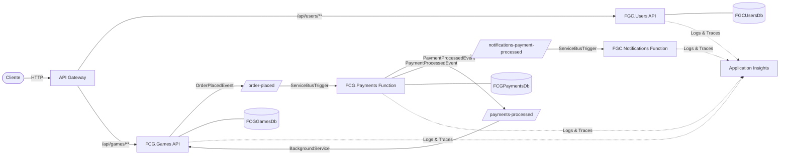
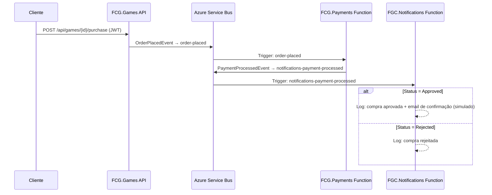

# FGC.Notifications

Microsserviço de notificações para a plataforma FCG (FIAP Cloud Games). Processa eventos de pagamento e envia notificações (simuladas via log) de forma assíncrona através de Azure Functions com trigger de Azure Service Bus. Projeto da **Fase 3 do Tech Challenge — PosTech FIAP**.

## Fluxo de Comunicação entre Microsserviços



## Fluxo de Notificações



## Arquitetura

Azure Function Isolated Worker (.NET 8) com estrutura simples:

```
NotificationsAPI/
├── Functions/
│   └── PaymentProcessedFunction.cs   # Azure Function (ServiceBusTrigger)
├── Shared/
│   └── Events/
│       └── PaymentProcessedEvent.cs  # Evento de domínio
├── Program.cs                        # Startup (Serilog + Application Insights)
├── host.json                         # Configuração do Azure Functions
├── appsettings.json                  # Configuração do Serilog
├── Dockerfile                        # Multi-stage build
└── NotificationsAPI.csproj
```

## Function

### PaymentProcessedFunction

- **Trigger**: Azure Service Bus — queue `notifications-payment-processed`
- **Input**: `ServiceBusReceivedMessage` com `PaymentProcessedEvent` no body
- **Comportamento**:
  - `Status == "Approved"` → Loga confirmação de compra + simula envio de email
  - `Status != "Approved"` → Loga rejeição do pagamento
  - Evento nulo/inválido → Log de warning

## Configuração

| Variável | Descrição | Padrão |
|----------|-----------|--------|
| `SERVICEBUS_CONNECTION` | Connection string do Azure Service Bus | (obrigatório) |
| `APPLICATIONINSIGHTS_CONNECTION_STRING` | Application Insights | (desabilitado se vazio) |

## CI/CD

Pipeline GitHub Actions (`.github/workflows/ci-cd.yml`):

- **CI** (push + PR na master): restore → build
- **CD** (apenas push na master): build Docker → push ACR → deploy Azure Container App

## Build & Run

```bash
# Build
dotnet build

# Rodar Functions localmente (requer Azure Functions Core Tools)
cd NotificationsAPI
func start
```

## Docker

```bash
docker build -f NotificationsAPI/Dockerfile -t fgc-notifications .
docker run -p 5099:80 \
  -e SERVICEBUS_CONNECTION="Endpoint=sb://..." \
  fgc-notifications
```

## Observabilidade

- **Serilog** com sinks para Console e Application Insights
- **Application Insights** para logs, traces e métricas centralizados
- Logs estruturados com `ServiceName: FGC.Notifications`

## Tecnologias

- .NET 8.0
- Azure Functions (Isolated Worker)
- Azure Service Bus (Queues)
- Serilog + Application Insights
